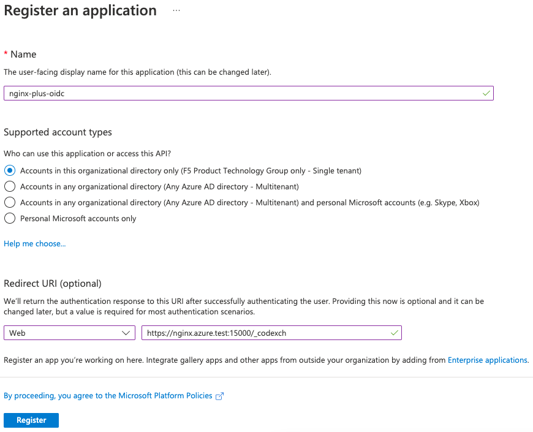
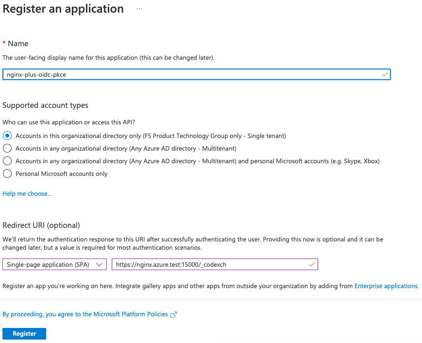
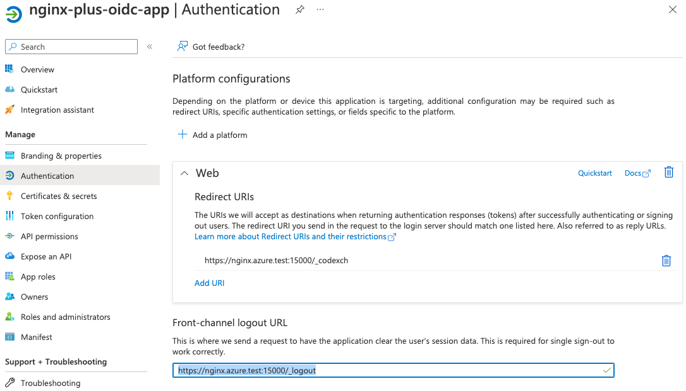
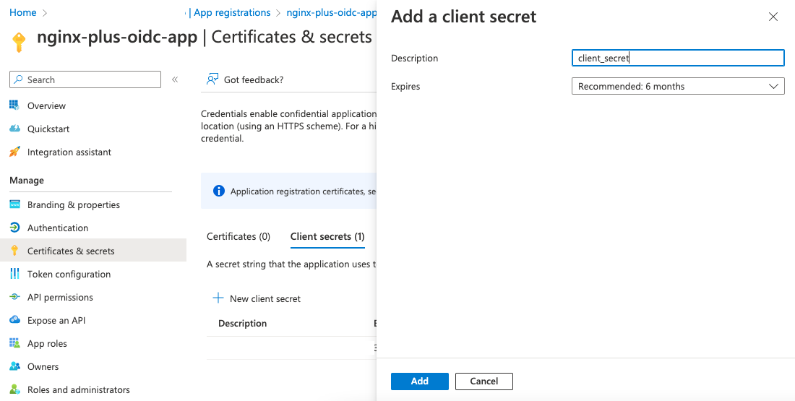
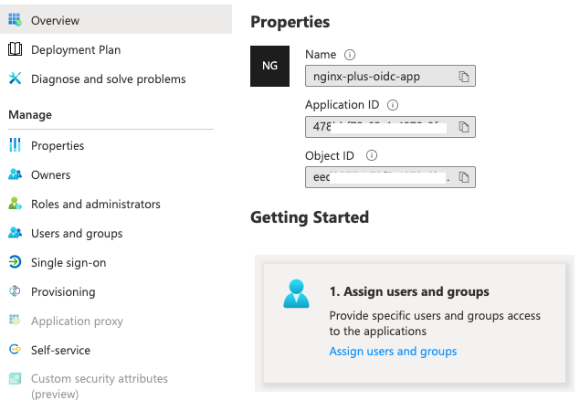

# How To Configure Azure AD for NGINX Plus OIDC Integration

Take the following steps to create a new application of Azure AD for integrating with NGINX Plus.

> **Note:**
>
> The following procedure reflects the Azure AD GUI at the time of publication, but the GUI is subject to change. Use this guide as a reference and adapt to the current Azure AD GUI as necessary.

- [Create an Account](#create-an-account)
- [Create an App](#create-an-app)
- [Create a Secret](#create-a-secret)
- [Add Users](#add-users)
- [Add Groups](#add-groups)

## Create an Account

1. If you don’t already use Azure, [create an account](https://azure.microsoft.com/en-us/free/).

2. Navigate to the [Azure portal](https://portal.azure.com/#home) and click **Azure Active Directory** in the left navigation column.

   

   In this document we are using features that are available in the Premium version of AD and not the standard free version. If you don’t already have the Premium version (as is the case for new accounts), you can start a free trial as prompted on the AD **Overview** page.

## Create an App

1. On the **App registrations** page, click **New registration**.

   

2. On the **Register an application** page that opens, enter values in the **Name** and **Redirect URI** fields, click the appropriate radio button in the **Supported account types** section, and then click the \*\* **Register** \*\* button. We’re using the following values:

   - Supported account types – Account in this organizational directory only
   - Option 1. Choose **Post** if you don't enable **PKCE**.

     - Name – `nginx-plus-oidc`
     - Redirect URI – `Web`: `https://nginx.azure.test:15000/_codexch`

       > **Notes:**
       >
       > - For production, we strongly recommend that you use SSL/TLS (port 443).
       > - The port number is mandatory even when you’re using the default port for HTTP (80) or HTTPS (443). But it it isn't needed if you use NGINX ACM.

       

     

   - Option 2. Choose **None** if you enable **PKCE**.

     - Name – `nginx-plus-oidc-pkce`
     - Redirect URI – `Singpe-page application(SPA)`: `https://nginx.azure.test:15000/_codexch`

       > **Notes:**
       >
       > - For production, we strongly recommend that you use SSL/TLS (port 443).
       > - The port number is mandatory even when you’re using the default port for HTTP (80) or HTTPS (443). But it it isn't needed if you use NGINX ACM.

       

     

3. Make note of the values in the **Application (client) ID** and **Directory (tenant) ID** fields on the **nginx-plus-oidc-pkce** or **nginx-plus-oidc** confirmation page that opens.

   

4. Click **Redirect URIs** and add **Front-channel logout URL**.

   - Front-channel logout URL - `https://nginx.azure.test:15000/_logout`

     > **Notes:**
     >
     > - For production, we strongly recommend that you use SSL/TLS (port 443).
     > - The port number is mandatory even when you’re using the default port for HTTP (80) or HTTPS (443). But it (neither `80` or `443`) isn't needed if you use NGINX ACM.

   

## Create a Secret

> **Note:**
> This is only for the step when you don't enable PKCE.

1. In the **Manage** section of the left navigation bar, click **Certificates & secrets** (see the preceding screenshot). On the page that opens, click the **New client secret** button if you don't enable PKCE.

   

2. In the **Add a client secret** pop‑up window, enter the following values and click the **Add** button:

   - **Description** – **client_secret**
   - **Expires** – **choose default**

   Copy the value for **client_secret** that appears.

   

## Add Users

In addition to users with permission to manage any applications, the users listed here can view and edit this application registration.

> Note:
>
> Azure AD API is not documented here to automatically register owners who can view and edit this application.

## Add Groups

1. In the **Manage** section of the left navigation bar, click **Token configuration**. On the page that opens, click the **Add groups claim** button. Check the Groups assigned to the application box and the Group ID radio buttons (default) then finally the **Save** button.

   

2. Here is the result once the claim is created:

   

3. In the **Manage** section of the left navigation bar, click **Overview** again and click the link under Essentials for _Managed application in local directory_. On the page that opens, click the **1. Assign users and groups** and + **Add user/group** button to select one ore more Groups from the AAD having the users you wish to grant access for.

   

   
