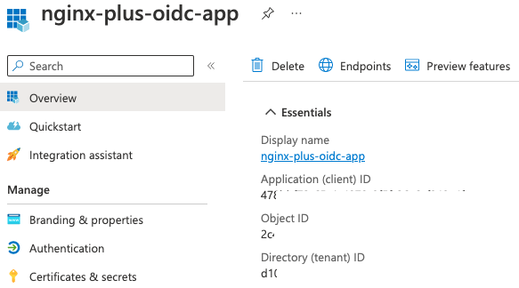

# How To Set Up NGINX Plus OIDC for Azure AD Integration

Take the following steps to set up NGINX Plus as the OpenID Connect relying party that runs.

## Configure NGINX OpenID Connect

1. Clone the [nginx-openid-connect/nginx-oidc-amazon-cognito](git@github.com:nginx-openid-connect/nginx-oidc-v1-amazon-cognito.git) GitHub repository, or download the repo files.

   ```bash
   git clone https://github.com/nginx-openid-connect/nginx-oidc-amazon-cognito.git
   ```

2. In the `oidc_idp.conf`, find the following directives(`$idp_domain`, `$idp_tenant_id`), and update them.

   You could find the `idp_tenant_id` in the **Directory (tenant) ID** section of Azure AD:

   

   ```nginx
    map $x_client_id $idp_domain {
        default "login.microsoftonline.com"; # "{{edit-IdP-Domain}}";
    }

    map $x_client_id $idp_tenant_id {
    default "{{edit-Directory (tenant) ID}}"; # use for Azure AD
    }
   ```

3. In the `oidc_idp.conf`, update `$oidc_client` and then update `$oidc_client_secret`, and `oidc_pkce_enable` accordingly as shown in below Options.

   ```nginx
    map $x_client_id $oidc_client {
        default "{{edit-your-IdP-client-ID}}";
    }
   ```

- Option 1. Update the following configuration if you don't enable **PKCE**.

  ```nginx
  map $x_client_id $oidc_client_secret {
      default "{{Edit-Your-IDP-Client-Secret}}";
  }

  map $x_client_id $oidc_pkce_enable {
      default 0;
  }
  ```

- Option 2. Update the following configuration if you enable **PKCE**.

  ```nginx
  map $x_client_id $oidc_client_secret {
      default ""; # Remove the client secret
  }

  map $x_client_id $oidc_pkce_enable {
      default 1;
  }
  ```

4. **Optional**: In the `oidc_nginx_server.conf`, update `$resolver` if you use local DNS servers.

   ```nginx
   resolver   8.8.8.8;         # For global DNS lookup of IDP endpoint
           # xxx.xxx.xxx.xxx; # For your local DNS lookup
           # 127.0.0.11;      # For local Docker DNS lookup
   ```

## Optional Configuration

This repo provides a sample container environment that contains the bundle frontend/backend applications. So you can skip this step if you would like to locally test using a container.

1. In the `oidc_frontend_backend.conf` file, update the server IP addresses and ports under the upstreams of `my_frontend_site` and `my_backend_app` if you want to test your applications.

   ```nginx
   # Sample upstream server for the frontend site.
   #
   upstream my_frontend_site {
       zone my_frontend_site 64k;
       server 127.0.0.1:9091;
   }

   # Sample upstream server for the backend app.
   #
   upstream my_backend_app {
       zone my_backend_app 64k;
       server 127.0.0.1:9092;
   }
   ```

2. Copy the following files to the `/etc/nginx/conf.d` directory on the host machine where NGINX Plus is installed if you want to test the files in your remote machine:

   - `oidc_frontend_backend.conf`
   - `oidc.js`
   - `oidc_idp.conf`
   - `oidc_nginx_http.conf`
   - `oidc_nginx_server.conf`
   - `docker/build-context/nginx/test/proxy_server_test.conf`

3. Update `/etc/nginx/nginx.conf` with the following information if you want to test your applications in your remote machine:

   ```nginx
    http {
            :
        include conf.d/oidc_idp.conf;
        include conf.d/oidc_nginx_http.conf;
        include conf.d/oidc_frontend_backend.conf;
        include test/proxy_server_test.conf;
            :
    }
   ```

4. Copy the following directory to the `/usr/share/nginx/html/` directory on the host machine where NGINX Plus is installed if you want to test the files in your remote machine:

   ```bash
    cp -R docker/build-context/content/ /usr/share/nginx/html/
   ```

   > Note:
   >
   > Skip this step if you have your frontend files as these files are a sample frontend app to test the OIDC.

5. Test and reload the NGINX configuration if you want to test the files in your remote machine:

   ```bash
   sudo nginx -t
   sudo nginx -s reload
   ```
