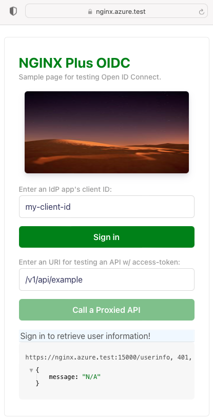
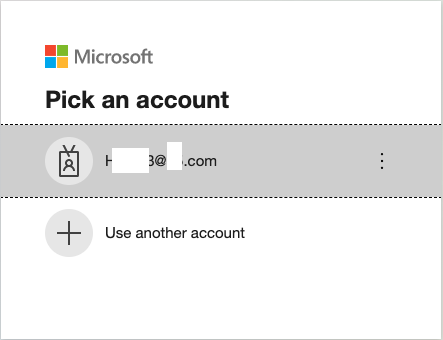
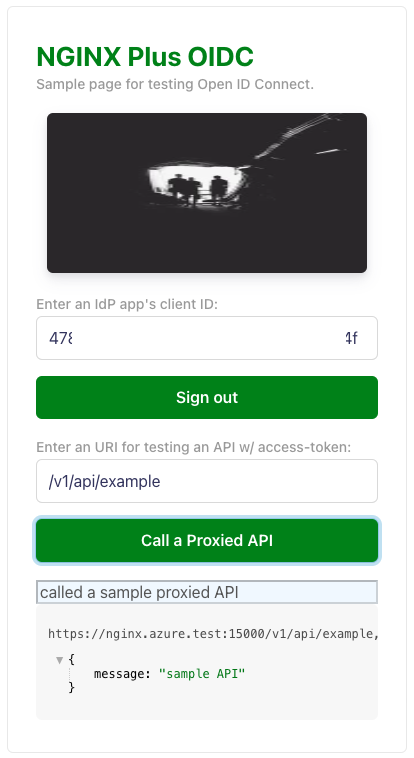

# How To Locally Test Containerized NGINX Plus OIDC for Azure AD Integration

Take the following steps to run NGINX Plus in a Docker container and test OIDC for Azure AD integration.

> Note: You could remotely test in your remote machine if you copy entire files there.

## 1. Prerequisites

- [Install and Run Docker](https://docs.docker.com/engine/install/)
- Edit `hosts` file in your laptop via if you want to locally test your app:

  ```bash
  $ sudo vi /etc/hosts
  127.0.0.1 nginx.azure.test
  ```

- [Download NGINX Plus license files](https://www.nginx.com/free-trial-request/), and copy them to `./docker/build-context/ssl/`

  ```
  nginx-repo.crt
  nginx-repo.key
  ```

## 2. Run a Docker Container

- **Start** a Docker container:

  ```bash
  $ make start
  ```

- **Check** Docker container's status:

  ```bash
  $ make watch
  ```

  

## 3. Run a Browser and Test OIDC

- **Run** a Web Browser with `https://nginx.azure.test:15000`, and enter an `IdP application`'s `client ID`:

  

- **Login** to click `Sign in` button:

  Enter your name and password which are registered in Azure AD.

  

  You will see the following screen once you are successfully signed-in.

  

- **Test** a secured sample API with access token by clicking `Call a Sample Proxied API`:

  > **Note:**
  >
  > Modify an URI if you want to test one of your API endpoints where access token is included in the header.

  

  - An endpoint of sample API is defined in `oidc_frontend_backend.conf`. You can add any API endpoint when you want to use an access token by referencing the following example:

  ```nginx
      location /v1/api/example {
          auth_jwt "" token=$id_token;
          auth_jwt_key_request /_jwks_uri;        # Enable when using URL

          proxy_set_header Authorization "Bearer $access_token";
          proxy_pass http://my_backend_app;
          access_log /var/log/nginx/access.log oidc_jwt;
      }
  ```

- **Logout** to click 'Sign out' button:

  

## 4. Stop and Remove Docker Containers

- **Stop** Docker containers

  ```bash
  $ make down
  ```

- **Remove** Docker container images

  ```bash
  $ make clean
  ```
