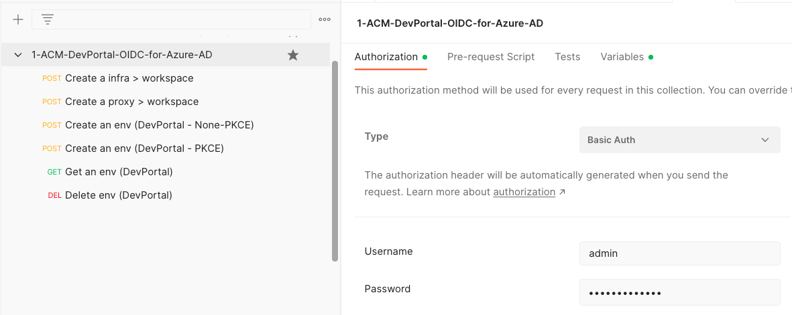

# How To Set Up NGINX ACM/DevPortal OIDC for Azure AD Integration

Take the following steps to set up NGINX ACM/DevPortal OIDC and test it for Azure AD integration.

## 1. Prerequisites

- [**Set up Azure AD**](./01-IdP-Setup.md)

  Ensure that you use **different application and callback/logout URLs** as the following example unlike that are already created to test your [containerized NGINX Plus](./02-NGINX-Plus-Setup.md).

  | Category                 | Example                                         |
  | ------------------------ | ----------------------------------------------- |
  | Application Name         | `nginx-devportal-app`                           |
  | Redirect URIs            | `https://nginx.devportal.azuread.test/_codexch` |
  | Front-channel logout URL | `https://nginx.devportal.azuread.test/_logout`  |

- Edit `hosts` file in your laptop via if you want to locally test your app:

  ```bash
  $ sudo vi /etc/hosts
  127.0.0.1 nginx.devportal.azuread.test
  ```

## 2. Install NGINX API Connectivity Manager

- [Download NGINX Management Suite](https://docs.nginx.com/nginx-management-suite/)

- [Install NGINX API Connectivity Manager](https://docs.nginx.com/nginx-management-suite/admin-guides/installation/install-guide/)

## 3. Set Up NGINX Dev Portal

Configure a Dev Portal by either referencing **NGINX Management Suite Docs** of [How To Set Up a NGINX Dev Portal](https://docs.nginx.com/nginx-management-suite/acm/getting-started/add-devportal/) or taking the following steps of calling APIs:

> **Note**:
>
> [Download an example of postman collection](./ACM-DevPortal-OIDC-for-Azure-AD.postman_collection.json) for easily testing the following steps.

- Open a Postman collection, and edit ACM password and variables:
  
  

- Create a `infra > workspace`:

  > `POST https://{{ctrl_ip}}/api/acm/v1/infrastructure/workspaces`
  >
  > `Body`:
  >
  > ```json
  > {
  >   "name": "{{infraworkspacename}}"
  > }
  > ```

- Create a `proxy > workspace`:

  > `POST https://{{ctrl_ip}}/api/acm/v1/services/workspaces`
  >
  > `Body`:
  >
  > ```json
  > {
  >   "name": "{{proxyworkspacename}}"
  > }
  > ```

- Create an environment of `Dev Portal`:
  post_json = load("./json/01-create-env.json")

  ```json
  post_json['name']
  ```

  > `POST https://{{ctrl_ip}}/api/acm/v1/infrastructure/workspaces/{{infraworkspacename}}/environments`

  **Option 1. Request Body for None PKCE**:

  ```json
  {
    "name": "{{environmentname}}",
    "functions": ["DEVPORTAL"],
    "proxies": [
      {
        "proxyClusterName": "{{devPinstanceGroupName}}",
        "hostnames": ["{{devPenvironmentHostname}}"],
        "runtime": "PORTAL-PROXY",
        "policies": {
          "oidc-authz": [
            {
              "action": {
                "authFlowType": "AUTHCODE",
                "jwksURI": "https://{{idpDomain}}/{{idpTenantId}}/discovery/keys",
                "tokenEndpoint": "https://{{idpDomain}}/{{idpTenantId}}/oauth2/v2.0/token",
                "userInfoEndpoint": "https://graph.microsoft.com/oidc/userinfo",
                "authorizationEndpoint": "https://{{idpDomain}}/{{idpTenantId}}/oauth2/v2.0/authorize",
                "logOffEndpoint": "https://{{idpDomain}}/{{idpTenantId}}/oauth2/v2.0/logout",
                "logOutParams": [],
                "TokenParams": [],
                "uris": {
                  "loginURI": "/login",
                  "logoutURI": "/logout",
                  "redirectURI": "/_codexch",
                  "userInfoURI": "/userinfo"
                }
              },
              "data": [
                {
                  "clientID": "{{clientId}}",
                  "clientSecret": "{{clientSecret}}",
                  "scopes": "openid+profile+email"
                }
              ]
            }
          ],
          "tls-inbound": [
            {
              "data": {
                "serverCerts": [
                  {
                    "key": "{{TLSKey}}",
                    "cert": "{{TLSCert}}"
                  }
                ]
              }
            }
          ]
        }
      }
    ]
  }
  ```

  **Option 2. Request Body for PKCE**:

  > Note: The configuration works. But PKCE is not supported yet.

  > ```json
  > {
  >        :
  >   "authFlowType": "PKCE",
  >        :
  >   "clientSecret": "{{clientSecret}}", -> Remove this line.
  >        :
  > }
  > ```

- Get an environment of `Dev Portal`:

  > `GET https://{{ctrl_ip}}/api/acm/v1/infrastructure/workspaces/{{infraworkspacename}}/environments`
  >
  > `Response`:
  >
  > ```
  > {
  >     :
  >     curl -k https://<CTRL-FQDN>/install/nginx-agent > install.sh && sudo sh install.sh -g devp-group && sudo systemctl start nginx-agent
  >     :
  > }
  > ```

- SSH into the instance of Dev Portal, and run the following commands:

  ```ssh
  curl -k https://<CTRL-FQDN>/install/nginx-agent > install.sh && sudo sh install.sh -g devp-group && sudo systemctl start nginx-agent
  ```

- Delete an environment of `Dev Portal`:

  > `DELETE https://{{ctrl_ip}}/api/acm/v1/infrastructure/workspaces/{{infraworkspacename}}/environments/{{environmentname}}`

## 3. Test Dev Portal OIDC with Azure AD

- Open a web browser and access the Dev Portal's FQDN like `http://nginx.devportal.cognito.test`.
- Try `Login` and `Logout`.
- Test the above TWO steps after changing IdP (PKCE option) and updating Dev Portal via NGINX ACM API.
